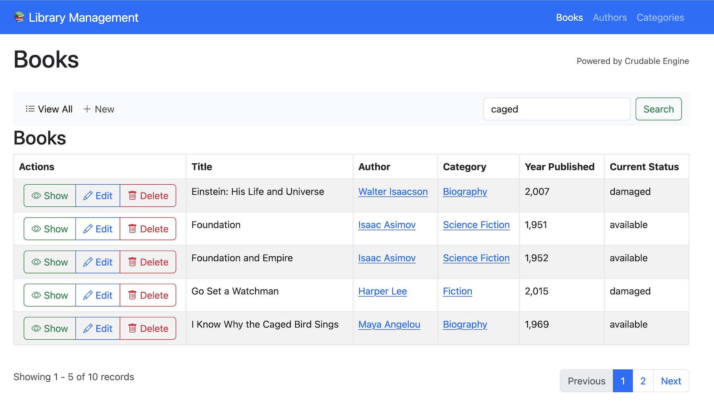
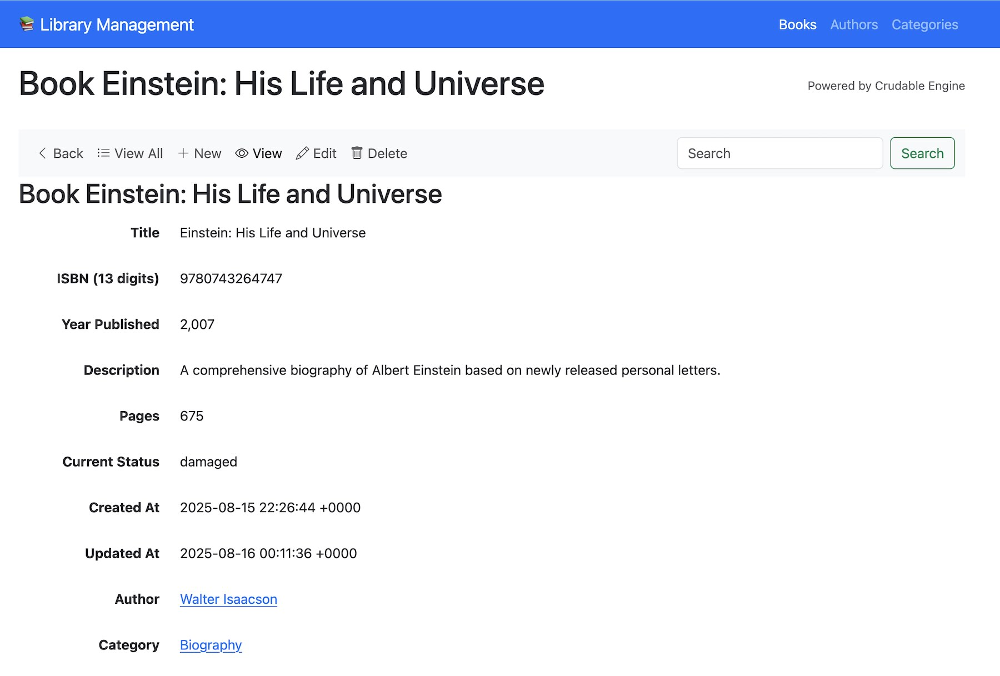
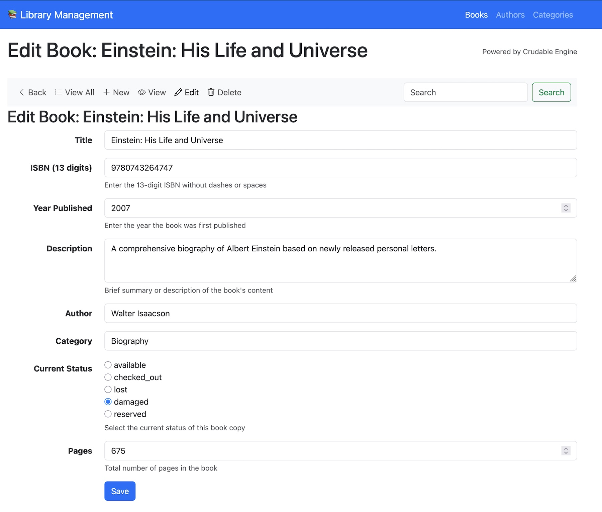

add a custom method book_count to show a
bulk editable attributes

Mention that the search_attributes uses an sql LIKE and is not optimized for
massive datasets. Tye can override the `apply_search_params(scope)` method if needed.


# Crudable Rails Engine

A powerful Rails engine that automatically builds listing pages, forms, and show
pages using a central customizable template, based on your ActiveRecord model
columns. Simply include the `CrudableRecord` concern in your models, configure
which attributes to display, and get a fully functional data entry interface.

## Features

- ✅ **Automatic View Generation** - One template system for all your models
- ✅ **Flexible Configuration** - DSL-style configuration per model
- ✅ **Bootstrap 5 Ready** - Modern, responsive UI out of the box
- ✅ **JSON:API Endpoints** - RESTful JSON APIs following the JSON:API specification
- ✅ **Nested Relationships** - Display associations with custom attributes
- ✅ **Custom Input Types** - Radio buttons, dropdowns, text areas, and more
- ✅ **Pagination & Sorting** - Built-in offset-based pagination
- ✅ **Search Functionality** - Configurable search across attributes
- ✅ **Template Overrides** - Customize any view to match your needs

## Screenshots

### Index Page with Search and Pagination


### Show Page with Nested Relationships  


### Edit Form with Custom Input Types


## Quick Start

### 1. Add to Your Model

```ruby
class Book < ApplicationRecord
  include CrudableRecord
  
  belongs_to :author
  belongs_to :category
  
  # Basic configuration - that's it!
  crudable :index_attributes, [:title, :author, :category, :status]
  crudable :edit_attributes, [:title, :author, :category, :status]
end
```

### 2. Add Routes

```ruby
Rails.application.routes.draw do
  resources :books
end
```

### 3. Create Controller

```ruby
# Include CrudableControllerMethods in your controller
class BooksController < ApplicationController
  include CrudableControllerMethods
  
  crudable_controller_for Book
  crudable_actions [:index, :show, :create, :update, :destroy]
end
```

## Configuration Options

### Basic Attribute Lists

```ruby
class Product < ApplicationRecord
  include CrudableRecord
  
  # Customize which attributes appear in each context.
  # Or let it choose a sensable defaults (`text` columns not on index page).
  crudable :index_attributes, [:name, :price, :category, :status]
  crudable :show_attributes, [:name, :description, :price, :category, :status, :created_at]
  crudable :edit_attributes, [:name, :description, :price, :category_id, :status]
  crudable :search_attributes, [:name, :description]
end
```

### Advanced Configuration with Procs

```ruby
class Book < ApplicationRecord
  include CrudableRecord
  
  belongs_to :author
  belongs_to :category
  has_many   :reviews
  
  # Use procs for dynamic configuration
  crudable :show_attributes, proc { |attrs| 
    attrs - [:author_id, :category_id] + [:author, :category, :reviews] 
  }
  
  # Nested relationships with specific attributes
  crudable :show_attributes, proc { |attrs| 
    attrs + [{reviews: [:rating, :comment, :reviewer_name]}] 
  }
  
  # Belongs_to with custom attributes (displays as nested show view)
  crudable :show_attributes, proc { |attrs| 
    attrs + [{:category => [:name, :color, :description]}] 
  }
end
```

### Custom Input Types

```ruby
class User < ApplicationRecord
  include CrudableRecord
  
  # Radio buttons
  crudable :radio, :status, %w{active inactive pending}
  
  # Dropdowns with custom options
  # NOTE, still need to add your own validations.
  crudable :dropdown, :role, %w{admin user moderator}
  
  # Custom labels
  crudable :label, :email_address, "Email"
  crudable :label, :created_at, "Registration Date"
  
  # Input help text
  crudable :input_note, :bio, "Brief description visible to other users"
end
```

### Pagination and Sorting

```ruby
class Article < ApplicationRecord
  include CrudableRecord
  
  # Custom pagination limit
  crudable :pagination_limit, 25
  
  # Default sorting
  crudable :index_order, { created_at: :desc }
  crudable :index_order, { title: :asc, created_at: :desc }
end
```

## JSON:API Endpoints

Crudable automatically provides RESTful JSON API endpoints following the [JSON:API specification](https://jsonapi.org/). No additional configuration required!

### Available Endpoints

For any model with CrudableController, you get:

```bash
# Collection endpoints
GET    /books.json              # List all books
POST   /books.json              # Create a new book

# Individual resource endpoints  
GET    /books/5.json            # Show specific book
PATCH  /books/5.json            # Update specific book
DELETE /books/5.json            # Delete specific book
```

### Response Format

**Index Response (`/books.json`):**
```json
{
  "links": {
    "self": "/books.json",
    "next": "/books.json?offset=20"
  },
  "data": [
    {
      "id": 1,
      "title": "The Great Gatsby",
      "isbn": "9780743273565",
      "author": "F. Scott Fitzgerald",
      "category": "Fiction"
    }
  ]
}
```

**Show Response (`/books/1.json`):**
```json
{
  "data": [
    {
      "id": 1,
      "title": "The Great Gatsby", 
      "isbn": "9780743273565",
      "description": "A classic American novel...",
      "author": "F. Scott Fitzgerald",
      "category": "Fiction",
      "status": "available"
    }
  ]
}
```

### Customizing JSON Output

The JSON responses respect your `api_attributes` configuration:

```ruby
class Book < ApplicationRecord
  include CrudableRecord
  
  # Customize what appears in JSON responses
  crudable :api_attributes, [:id, :title, :isbn, :status, :author, :category]
end
```

## Relationship Display

### Has Many Relationships

```ruby
class Author < ApplicationRecord
  include CrudableRecord
  has_many :books
  
  # Show books with specific attributes in a table
  crudable :show_attributes, proc { |attrs| 
    attrs + [{books: [:title, :isbn, :status]}] 
  }
  
  # With actions specified. Don't show the "delete" button.
  # NOTE, this does not disable the DESTROY action on the controller.
  crudable :show_attributes, proc { |attrs| 
    attrs + [{books: {attributes: [:title, :status], actions: [:show, :edit]}}] 
  }
end
```

### Belongs To Relationships

```ruby
class Book < ApplicationRecord
  include CrudableRecord
  belongs_to :author
  belongs_to :category
  
  # Simple association display (shows as link)
  crudable :show_attributes, proc { |attrs| attrs + [:author] }
  
  # Nested attribute display (shows as embedded form)
  crudable :show_attributes, proc { |attrs| 
    attrs + [{:category => [:name, :color, :description]}] 
  }
end
```

## Template Overrides

Crudable allows you to override any template to customize the UI for specific models or globally.

### Override Specific Model Templates

Create templates in your app using the model's plural name:

```
app/views/books/
├── index.html.erb          # Override entire index page
├── show.html.erb           # Override entire show page  
├── edit.html.erb           # Override entire edit page
├── new.html.erb            # Override entire new page
├── _form.html.erb          # Override form partial
└── _[attribute_name]_input.html.erb  # Custom field input
```

### Override Individual Form Fields

For custom input rendering, create a partial named after the attribute:

```ruby
# app/views/books/_status_input.html.erb
<div class="custom-status-field">
  <%= f.select :status, options_for_select([
    ['📗 Available', 'available'],
    ['📘 Checked Out', 'checked_out'], 
    ['📙 Reserved', 'reserved'],
    ['📕 Lost', 'lost']
  ]), {}, {class: 'form-control'} %>
</div>
```

### Override Engine Templates Globally

To override templates for all models, copy them from the engine:

```bash
# Copy templates to your app
cp -r crudable/app/views/crudable/* app/views/crudable/
```

Then modify as needed. Available templates and partials:

```
app/views/crudable/
├── index.html.erb                  # Global index template
├── show.html.erb                   # Global show template
├── edit.html.erb                   # Global edit template
├── new.html.erb                    # Global new template
├── index.json.erb                  # JSON API index response
├── show.json.erb                   # JSON API show response
├── _form.html.erb                  # Global form partial
├── _listing.html.erb               # Global table listing (for collections)
├── _show.html.erb                  # Global show partial (for single records)
├── _nav.html.erb                   # Global navigation bar
├── _search.html.erb                # Global search form
├── _header.html.erb                # Page header with title
├── _data_table.html.erb            # Alternative table layout
├── _hashmap_show.html.erb          # Display for Hash objects
├── _check_box_select.html.erb      # Multi-select checkbox component
└── _nav_filter_dropdowns.html.erb  # Navigation filter dropdowns (ex, filter by status)
```

### Extending Helper Methods

Crudable uses an extendable helper pattern. To add your own helper methods or include other helpers, create this file in your app:

```ruby
# app/helpers/crudable/extendable_helper.rb
module Crudable
  module ExtendableHelper
    include CrudableHelper  # Required for core functionality
    include YourOtherHelpers  # Optional: include other helpers
    
    # Add your custom helper methods
    def custom_status_badge(status)
      case status
      when 'active'
        content_tag :span, status.titleize, class: 'badge bg-success'
      when 'inactive'
        content_tag :span, status.titleize, class: 'badge bg-danger'
      else
        content_tag :span, status.titleize, class: 'badge bg-secondary'
      end
    end
  end
end
```

### Custom Navigation Links

Add extra navigation items by creating partials:

```ruby
# app/views/books/_nav_links_extra.html.erb
<li class="nav-item">
  <%= link_to "Export CSV", books_path(format: :csv), class: "nav-link" %>
</li>
<li class="nav-item">
  <%= link_to "Import", import_books_path, class: "nav-link" %>
</li>
```

```ruby
# app/views/books/_nav_extra.html.erb
<div class="navbar-text">
  Total: <%= Book.count %> books
</div>
```

## Styling and Javascript

Crudable uses Bootstrap 5 for styling. Include Bootstrap CSS and JS in your layout:

```html
<!-- app/views/layouts/application.html.erb -->
<link href="https://cdn.jsdelivr.net/npm/bootstrap@5.3.0/dist/css/bootstrap.min.css" rel="stylesheet">
<link href="https://cdn.jsdelivr.net/npm/bootstrap-icons@1.10.0/font/bootstrap-icons.css" rel="stylesheet">

<script src="https://cdn.jsdelivr.net/npm/bootstrap@5.3.0/dist/js/bootstrap.bundle.min.js"></script>

<!-- May need to add this if your application template
     if the delete buttons aren't showing a confirmation alert. -->
<script src="https://cdn.jsdelivr.net/npm/@rails/ujs@7.0.0/lib/assets/compiled/rails-ujs.js"></script>
```

## Advanced Examples

### Complete Model Configuration

```ruby
class Product < ApplicationRecord
  include CrudableRecord
  
  belongs_to :category
  belongs_to :supplier
  has_many :reviews
  has_many :order_items
  
  # Attribute configurations
  crudable :index_attributes, [:name, :category, :price, :stock_level, :status]
  crudable :show_attributes, proc { |attrs| 
    attrs - [:category_id, :supplier_id] + [
      :category, 
      {:supplier => [:name, :email, :phone]},
      {:reviews => [:rating, :comment, :reviewer_name]},
      :total_sold
    ] 
  }
  crudable :edit_attributes, [:name, :description, :price, :category_id, :supplier_id, :stock_level, :status]
  crudable :search_attributes, [:name, :description, :sku]
  
  # UI Configuration
  crudable :pagination_limit, 20
  crudable :index_order, { name: :asc }
  
  # Input types
  crudable :radio, :status, %w{active discontinued limited_stock}
  crudable :dropdown, :category_id, -> { Category.active.pluck(:name, :id) }
  
  # Labels and help
  crudable :label, :stock_level, "Items in Stock"
  crudable :label, :category_id, "Product Category"
  crudable :input_note, :price, "Enter price in USD without currency symbol"
  crudable :input_note, :stock_level, "Current inventory count"
  
  def total_sold
    order_items.sum(:quantity)
  end
end
```

### Complex Nested Relationships

```ruby
class Order < ApplicationRecord
  include CrudableRecord
  
  belongs_to :customer
  has_many :order_items
  has_many :products, through: :order_items
  
  crudable :show_attributes, proc { |attrs| 
    attrs - [:customer_id] + [
      {:customer => [:name, :email, :phone]},
      {:order_items => {
        attributes: [:product, :quantity, :unit_price, :total_price],
        actions: [:show, :edit]
      }},
      :order_total,
      :order_status
    ] 
  }
end
```

## Installation

Add this line to your application's Gemfile:

```ruby
gem "crudable"
```

And then execute:
```bash
$ bundle
```

Or install it yourself as:
```bash
$ gem install crudable
```

## Demo Application

This engine includes a complete demo application showcasing a Library Management
System with Books, Authors, and Categories. Run the demo:

```bash
# Run the test dummy app:
bundle install
cd crudable/test/dummy
rails db:create db:migrate db:seed
rails server -p 5000
# Visit http://localhost:5000
```

Visit http://localhost:5000 to see Crudable in action!

## What Crudable Does NOT Provide

Crudable is focused on providing CRUD interfaces and does not implement the
following security and business logic features. These are are left for you to
decide how to implement.

### 🚫 **Authentication & Authorization**
- **No user authentication** - You need to implement login/logout yourself
- **No authorization/permissions** - No built-in role-based access control
- **No API authentication** - JSON endpoints are open by default
- **No action-level permissions** - All CRUD actions are available to all users

### 🚫 **Data Security**
- **No input validation** - You must add your own `validates` in your models
- **No password encryption** - Use `has_secure_password` or Devise for user auth
- **No sensitive data protection** - No automatic filtering of sensitive fields
- **No SQL injection or Cross-site scripting (XSS) protection beyond Rails defaults**

### 🚫 **Business Logic**
- **No workflow management** - No state machines or approval processes  
- **No audit trails** - No automatic logging of changes
- **No soft deletes** - Records are permanently deleted
- **No versioning** - No history of record changes

### 🚫 **Advanced Features**
- **No file uploads** - No image/document handling
- **No email notifications** - No automatic emails for actions
- **No background jobs** - No async processing
- **No caching** - No performance optimizations beyond basic pagination

### ⚠️ **Security Considerations**

**Crudable is designed for admin interfaces and internal tools.** For public-facing applications, you must implement:

```ruby
# Add your own authentication
class BooksController < ApplicationController
  include CrudableControllerMethods
  
  crudable_controller_for Book
  crudable_actions [:index, :show, :create, :update, :destroy]
  
  before_action :authenticate_user!
  before_action :require_admin!
end

# Add your own validations
class Book < ApplicationRecord
  include CrudableRecord
  
  validates :title, presence: true, length: { maximum: 255 }
  validates :isbn, presence: true, uniqueness: true
  # Add more validations as needed
end

# Add your own authorization
class BooksController < ApplicationController
  include CrudableControllerMethods
  
  crudable_controller_for Book
  crudable_actions [:index, :show, :create, :update] # Note: no :destroy
  
  before_action :check_permissions
  
  # override to customize (soft delete instead of hard delete)
  def destroy
    @record.update(status: "deleted")
    redirect_to index_path(model_class), notice: "#{model_class} was marked as deleted."
  end
  
  private
  
  def check_permissions
    redirect_to root_path unless current_user.can_manage_books?
  end
end
```

**Use Crudable for:** Admin panels, internal tools, prototyping, development interfaces

**Don't use Crudable for:** Public APIs, user-facing forms, production apps without additional security

## Requirements

- Rails 6.0+
- Bootstrap 5.0+
- Bootstrap Icons (for UI icons)

## Contributing

1. Fork the repository
2. Create your feature branch (`git checkout -b feature/amazing-feature`)
3. Commit your changes (`git commit -m 'Add amazing feature'`)
4. Push to the branch (`git push origin feature/amazing-feature`)
5. Open a Pull Request

## License

The gem is available as open source under the terms of the [MIT License](https://opensource.org/licenses/MIT).
